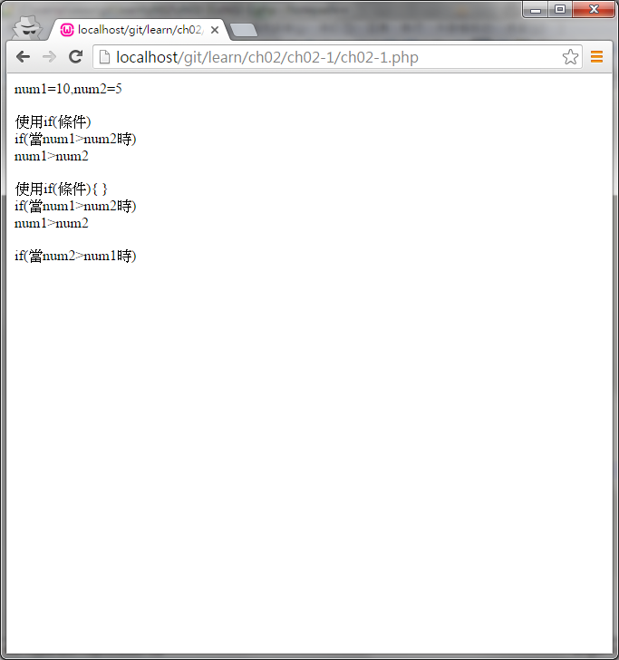

#ch01-1 if條件式

提供if條件式的使用方法

在達成if(條件成立)的情況下才會執行接下來的程式區段

##目錄

|檔案                                        |說明                                         |
|--------------------------------------------|---------------------------------------------|
|[ch02-1](ch02-1.php)                        |if條件式的使用                               |

