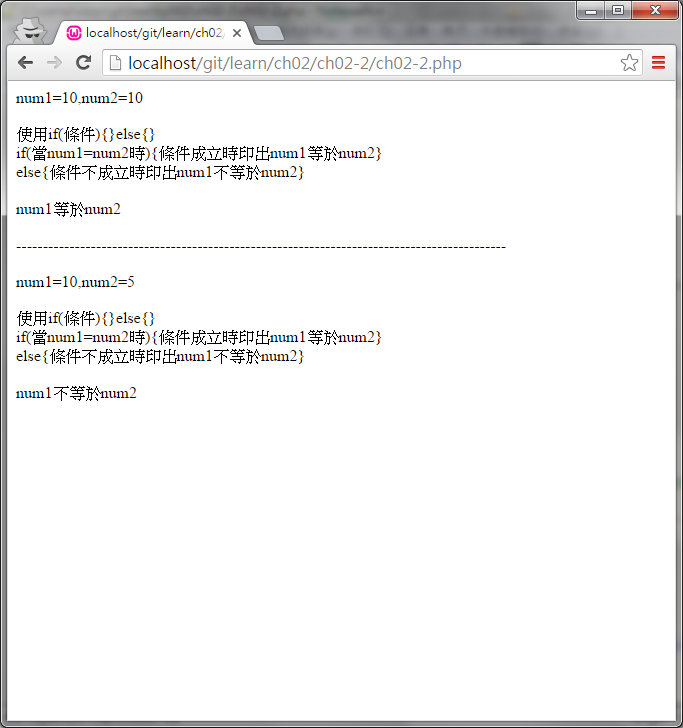

#ch01-1 if else

提供if else的使用方法

在達成if(條件成立)的情況下才會執行接下來的程式區段

否則執行另外一個程式區段

##目錄

|檔案                                        |說明                                         |
|--------------------------------------------|---------------------------------------------|
|[ch02-2](ch02-2.php)                        |if else的使用                                |

