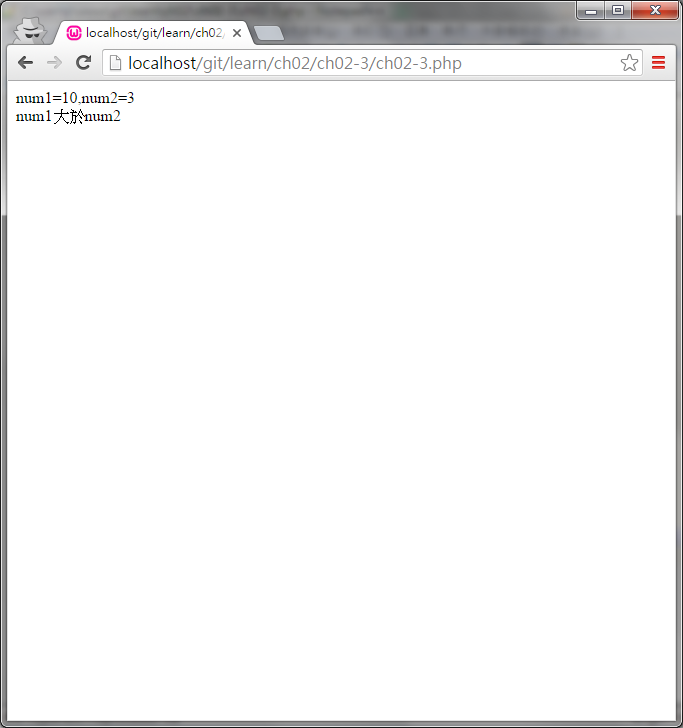
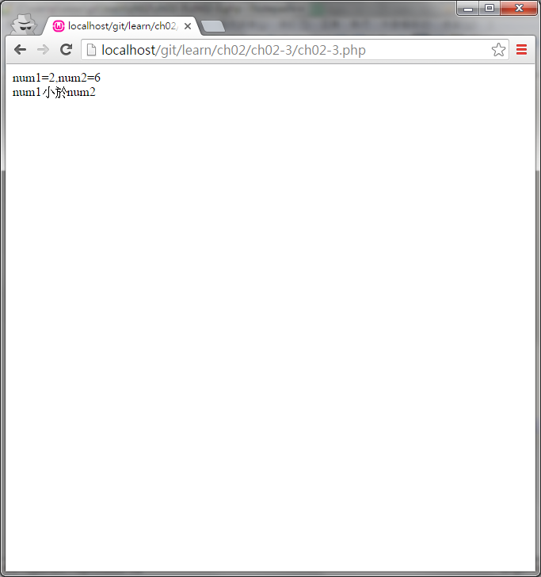
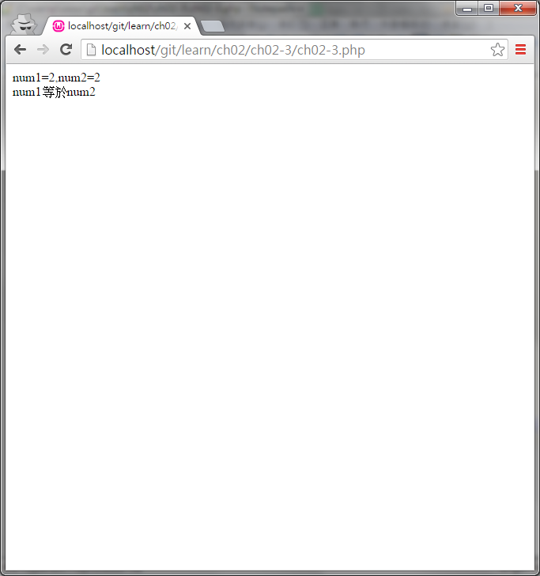

#ch02-3 if else if else

提供if else if else的使用方法

在達成if(條件)成立的情況下才會執行接下來的程式區段

如果沒有條件成立會看接下來else if(條件)有沒有成立，如果有責執行接下來的程式區段

當所有的if或else if的條件都不成立就會執行else底下的程式

##目錄

|檔案                                        |說明                                         |
|--------------------------------------------|---------------------------------------------|
|[ch02-3](ch02-3.php)                        |if else if else的使用                        |

