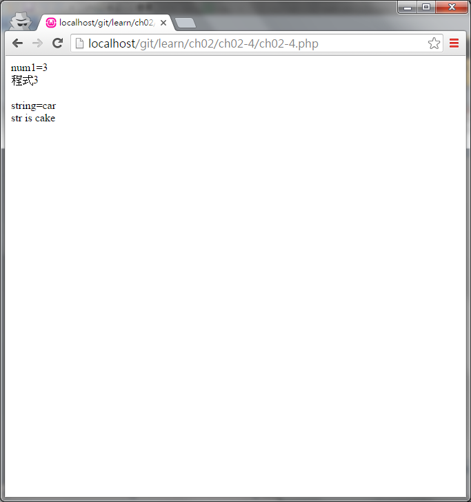
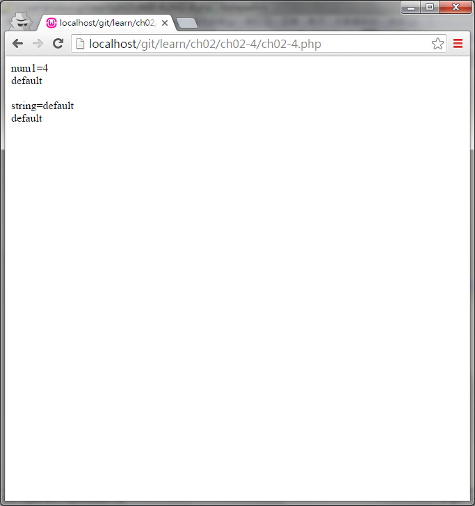

#ch02-4 switch

提供switch的使用方法

使用switch後可以依照不同的case給予不同的程式執行

case的使用方式有點類似於if、else if

default則相似於else有沒有使用都可以

##目錄

|檔案                                        |說明                                         |
|--------------------------------------------|---------------------------------------------|
|[ch02-4](ch02-4.php)                        |switch的使用                                 |

