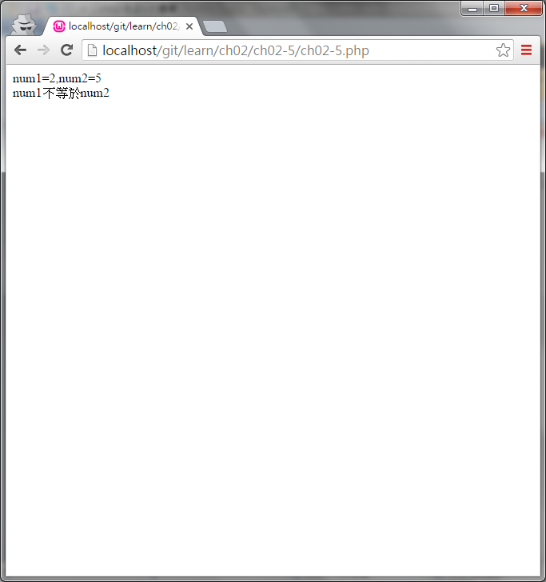
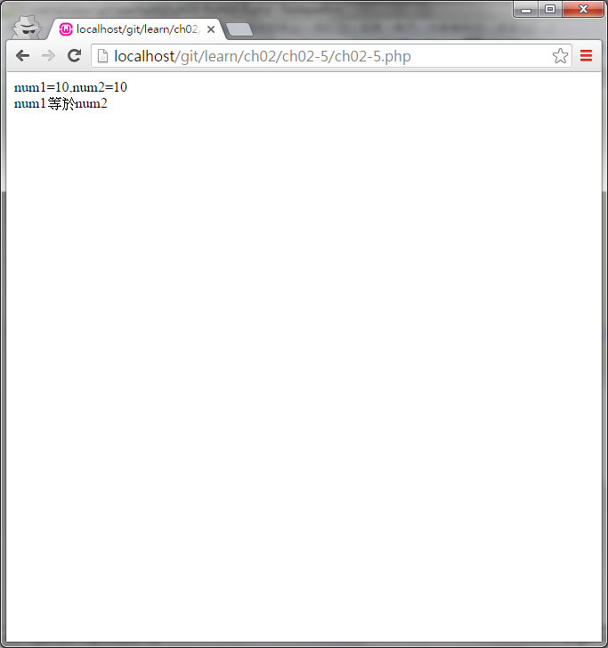

#ch02-5 三元運算

提供三元運算的使用方法

使用(條件?程式1:程式2)後若達成條件執行程式1,否則執行程式2

##目錄

|檔案                                        |說明                                         |
|--------------------------------------------|---------------------------------------------|
|[ch02-5](ch02-5.php)                        |三元運算的使用                               |

