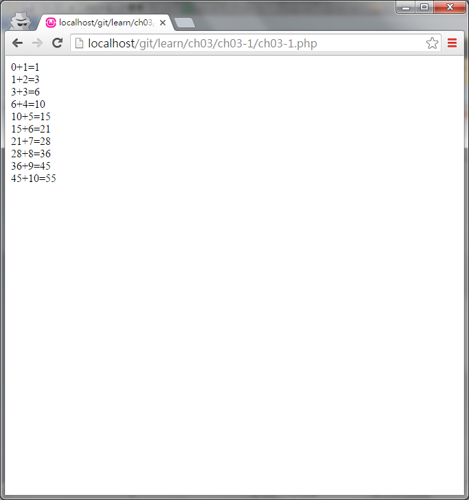

#ch03-1 for迴圈

常用的迴圈方式之一

使用方法為

for(條件){要重複的程式}

在達成條件的情況下會重複執行程式

在for的條件中可以同時設定變數的初始值;條件;變數增減

##目錄

|檔案                                        |說明                                         |
|--------------------------------------------|---------------------------------------------|
|[ch03-1](ch03-1.php)                        |for迴圈的使用                                |

