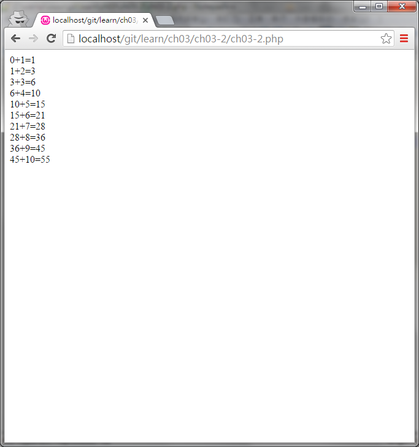

#ch03-2 while迴圈

常用的迴圈方式之一

使用方法為

while(條件){要重複的程式}

在達成條件的情況下會重複執行程式

要注意的一點是他的條件沒辦法像for一樣設定初始值;條件;變數增減

必須要注意條件的地方，沒有設定好終止條件可能會導致無窮迴圈

##目錄

|檔案                                        |說明                                         |
|--------------------------------------------|---------------------------------------------|
|[ch03-2](ch03-2.php)                        |while迴圈的使用                              |

