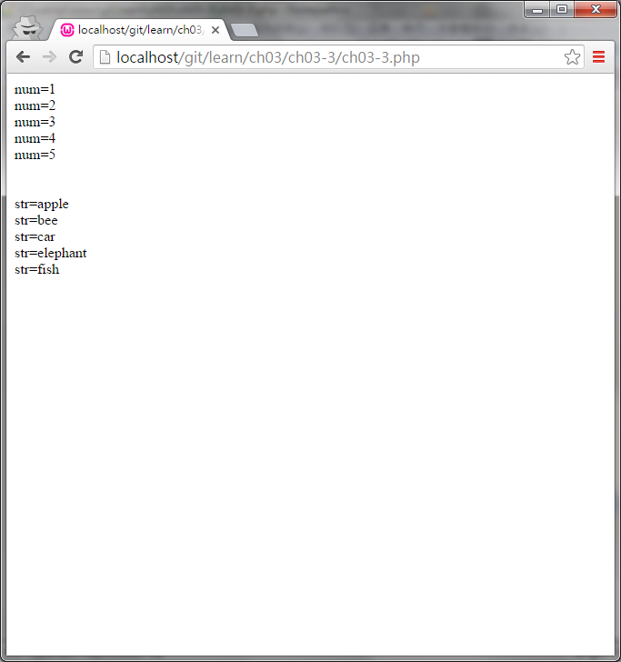

#ch03-3 foreach

foreach可以拿來跑陣列的迴圈

將陣列丟給foreach後他會一次一次的將陣列的內容提取出來

使用的方法為

foreach(陣列 as 變數){要重複的程式}

foreach會執行陣列長度的次數

每次執行就將執行次數的陣列值放入變數中可以供要重複的程式使用

##目錄

|檔案                                        |說明                                         |
|--------------------------------------------|---------------------------------------------|
|[ch03-3](ch03-3.php)                        |foreach的使用                                |

