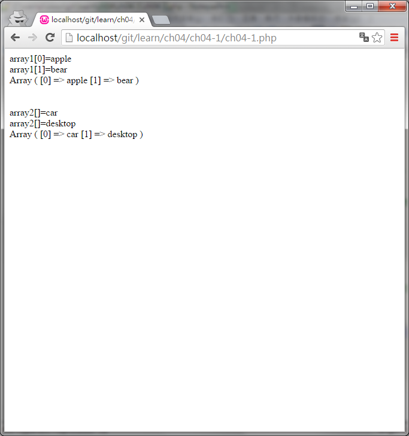

#ch04-1 一維陣列

一維陣列的概念就像是建立一個一排的儲存空間

	□  □  □  □  □  

然後可以在這些空間分別放入想放入的值

	□  □  □  □  □  
	1  2  3  4  5
  

##目錄

|檔案                                        |說明                                         |
|--------------------------------------------|---------------------------------------------|
|[ch04-1](ch04-1.php)                        |一維陣列的使用                               |

