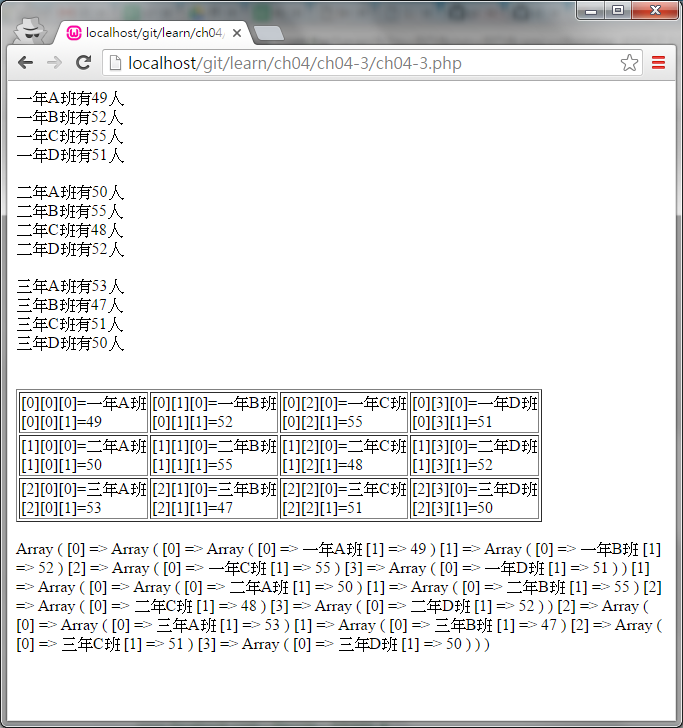

#ch04-3 三維陣列

在ch04-1提到一維陣列的概念就像是建立一個一排的儲存空間

那二維陣列就可以把他想像成有很多一排的儲存空間

以實體來看一維就像是一條線，二維是一個平面，三維可以看成一個立體

不過以純文字敘述不太好寫出來，所以可以把他看成由多個二維陣列堆疊起來

	□  □  □  □  □  
  
	□  □  □  □  □ 
	
	□  □  □  □  □ 
	-------------
	□  □  □  □  □  
  
	□  □  □  □  □ 
	
	□  □  □  □  □ 

	
然後可以在這些空間分別放入想放入的值

	□  □  □  □  □  
	1  2  3  4  5
	□  □  □  □  □  
	a  b  c  d  e  
	□  □  □  □  □  
	α  β  γ  δ  ε 
	-------------
	□  □  □  □  □  
	6  7  8  9  0
	□  □  □  □  □  
	f  g  h  i  j  
	□  □  □  □  □  
	ζ  η  θ  ι  κ

	
陣列在沒有指定給他哪個位置開始放值的話都是從[0][0][0]開始

	□          □          □          □          □  
	[0][0][0]  [0][0][1]  [0][0][2]  [0][0][3]  [0][0][4]
	□          □          □          □          □  
	[0][1][0]  [0][1][1]  [0][1][2]  [0][1][3]  [0][1][4]
	□          □          □          □          □  
	[0][2][0]  [0][2][1]  [0][2][2]  [0][2][3]  [0][2][4]
	------------------------------------------------------
	□          □          □          □          □  
	[1][0][0]  [1][0][1]  [1][0][2]  [1][0][3]  [1][0][4]
	□          □          □          □          □  
	[1][1][0]  [1][1][1]  [1][1][2]  [1][1][3]  [1][1][4]
	□          □          □          □          □  
	[1][2][0]  [1][2][1]  [1][2][2]  [1][2][3]  [1][2][4]

##目錄

|檔案                                        |說明                                         |
|--------------------------------------------|---------------------------------------------|
|[ch04-3](ch04-3.php)                        |三維陣列的使用                               |

