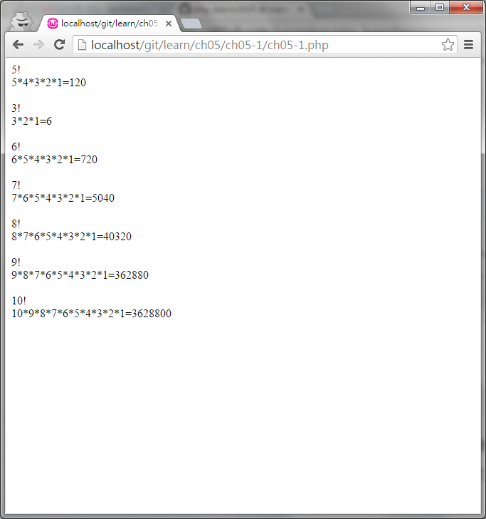

#ch05-1 function

function自訂函式

使用方法

function 函式名稱(參數)
{
程式區段
}

其中參數的部分可填可不填

呼叫方法

函式名稱(參數);

就可以執行此函式的程式區段
  

##目錄

|檔案                                        |說明                                         |
|--------------------------------------------|---------------------------------------------|
|[ch05-1](ch05-1.php)                        |function的使用                               |

