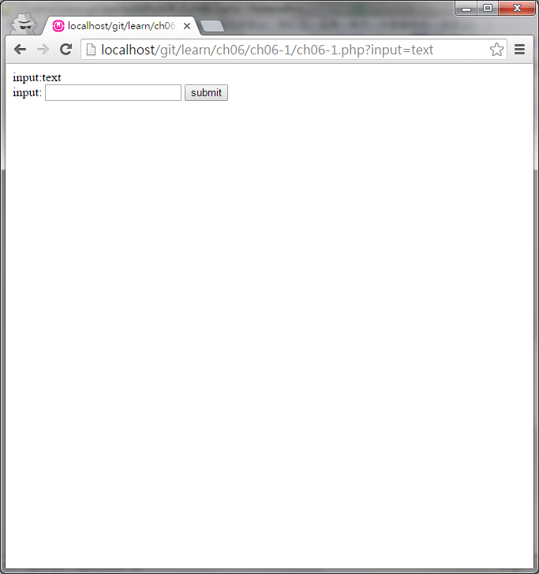

#ch06-1 get

使用GET來傳送資料

GET就是常見的網址後面會帶一串參數

例如:http://127.0.0.1/index.php?str=string

將參數string儲存給變數str

詳細應用可至 https://github.com/kuromikan/php_get_post/tree/master/get

##目錄

|檔案                                        |說明                                         |
|--------------------------------------------|---------------------------------------------|
|[ch06-1](ch06-1.php)                        |get的使用                                    |

