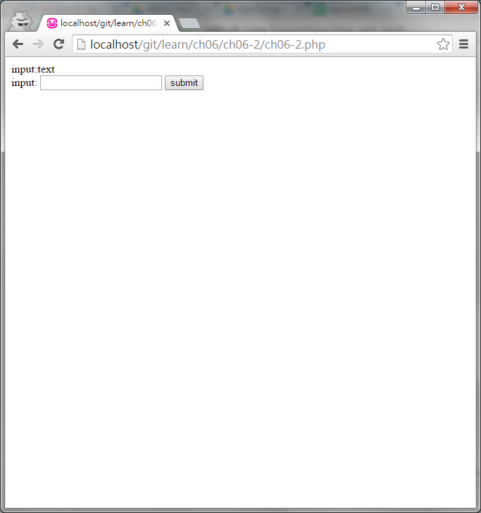

#ch06-2 post

使用psot來傳送資料

psot可將form標籤裡面的值帶給自己或其他頁面

例如輸入框、checkbox、選單等等

跟get最大的不同是他不會將參數放在網址上

詳細應用可至 https://github.com/kuromikan/php_get_post/tree/master/post

##目錄

|檔案                                        |說明                                         |
|--------------------------------------------|---------------------------------------------|
|[ch06-2](ch06-2.php)                        |post的使用                                   |

