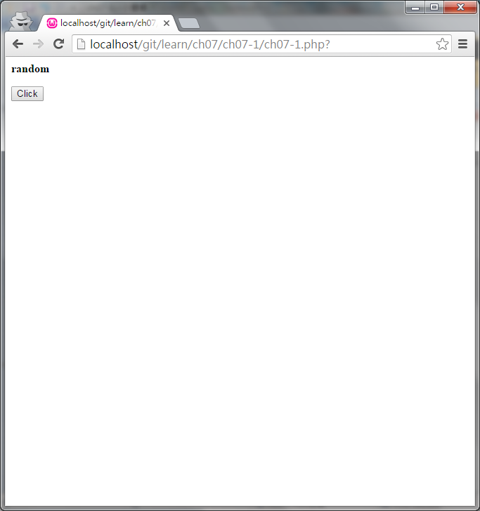
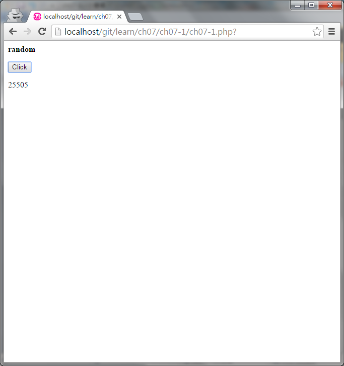
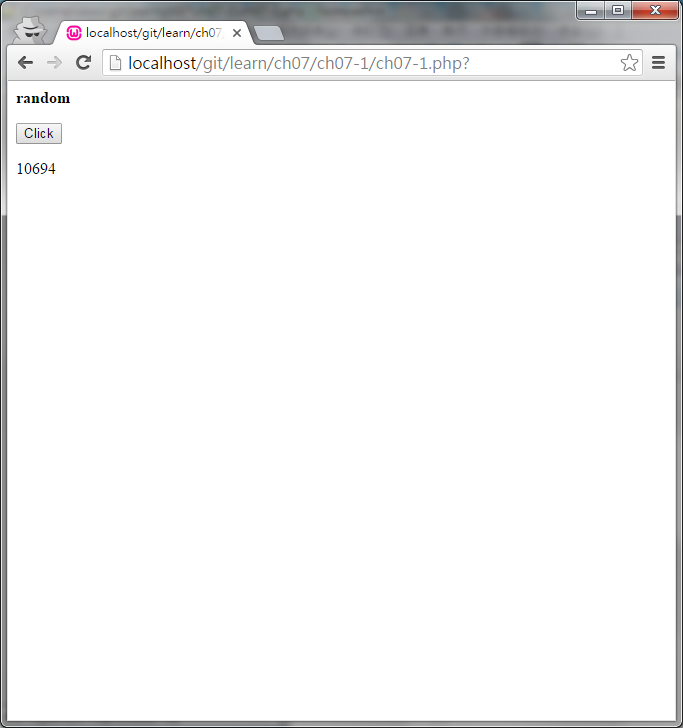

#ch07-1 ajax

ajax可用來跟伺服器傳送並接收資料

在傳遞上沒有刷新頁面的問題所以也不會造成畫面閃爍

範例為取亂數分成主頁面跟資料處理頁面

##目錄

|檔案                                        |說明                                         |
|--------------------------------------------|---------------------------------------------|
|[ch07-1](ch07-1.php)                        |ajax的使用                                   |
|[ch07-1-data](ch07-1-data.php)              |產生亂數供[ch07-1.php](ch07-1.php)使用       |

