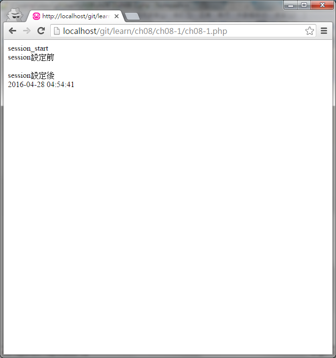

#ch08-1 session

session的使用

在程式開始記得打開session的功能

session_start();

之後就可以開始用session來存值了

$_SESSION["名稱"]=值;

如果需要刪除session可以用下列方法

unset($_SESSION["名稱"]);
session_destroy();

##目錄

|檔案                                        |說明                                         |
|--------------------------------------------|---------------------------------------------|
|[ch08-1](ch08-1.php)                        |session的使用                                |

