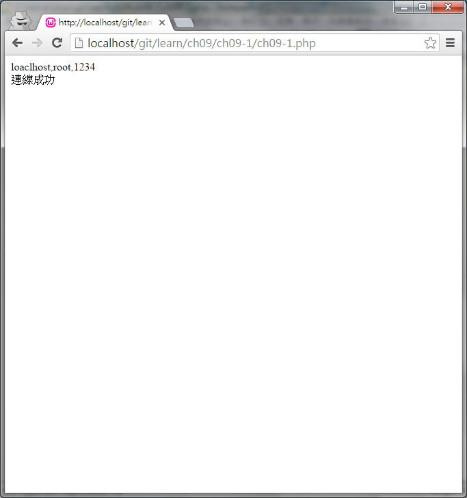

#ch09-1 mysql_connect

mysql_connect是一個php連線mysql的方法

mysql_connect的使用方式

$link = mysql_connect('主機位址', '帳號', '密碼');

這樣就可以跟mysql做連線了

要注意的一點是此方法將在php7後被移除

須改用mysqli或者pdo

mysqli的使用方法https://github.com/kuromikan/php_mysqli

pdo的使用方法https://github.com/kuromikan/php_pdo

##目錄

|檔案                                        |說明                                         |
|--------------------------------------------|---------------------------------------------|
|[ch09-1](ch09-1.php)                        |mysql_connect的使用                          |

