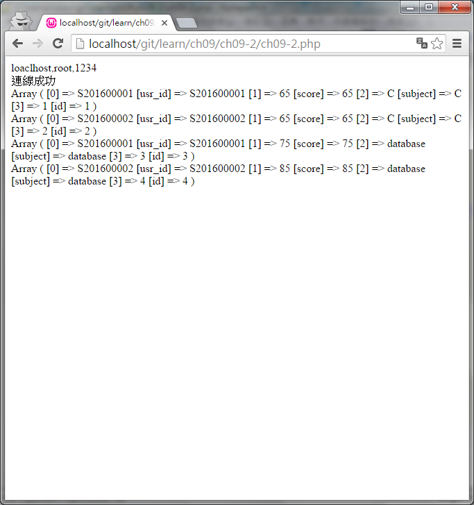

#ch09-2 mysql_query

在mysql_connect連線資料庫後

我們可以使用mysql_select_db選擇資料庫

之後使用mysql_query來送出sql語法來執行

要注意的一點是此方法將在php7後被移除

須改用mysqli或者pdo

mysqli的使用方法https://github.com/kuromikan/php_mysqli

pdo的使用方法https://github.com/kuromikan/php_pdo

##目錄

|檔案                                        |說明                                         |
|--------------------------------------------|---------------------------------------------|
|[ch09-2](ch09-2.php)                        |mysql_query的使用                            |
|[sample_db.sql](sample_db.sql)              |範例用的資料庫檔                             |

